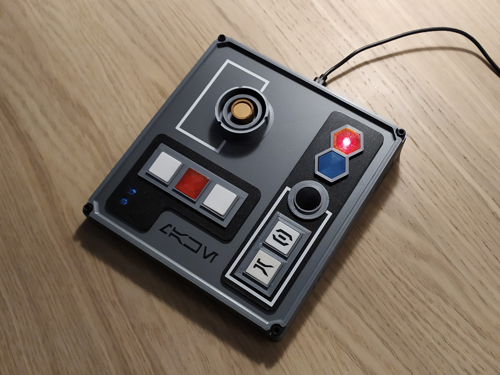
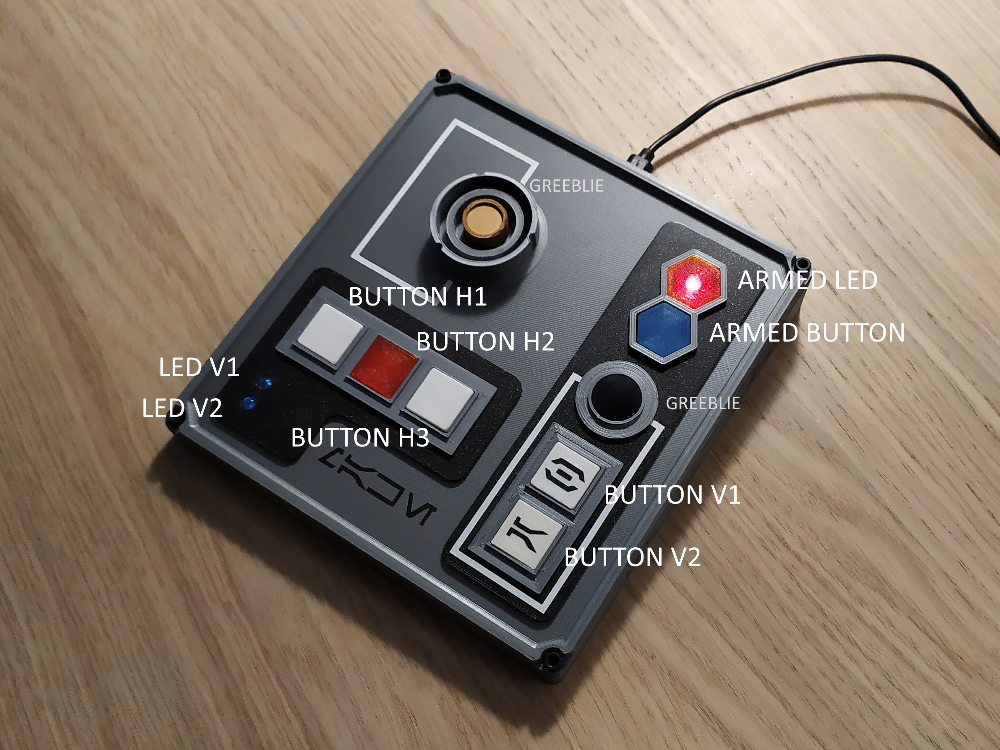
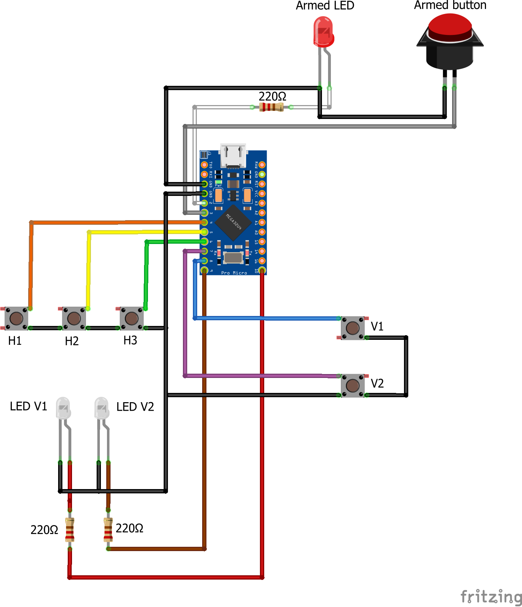
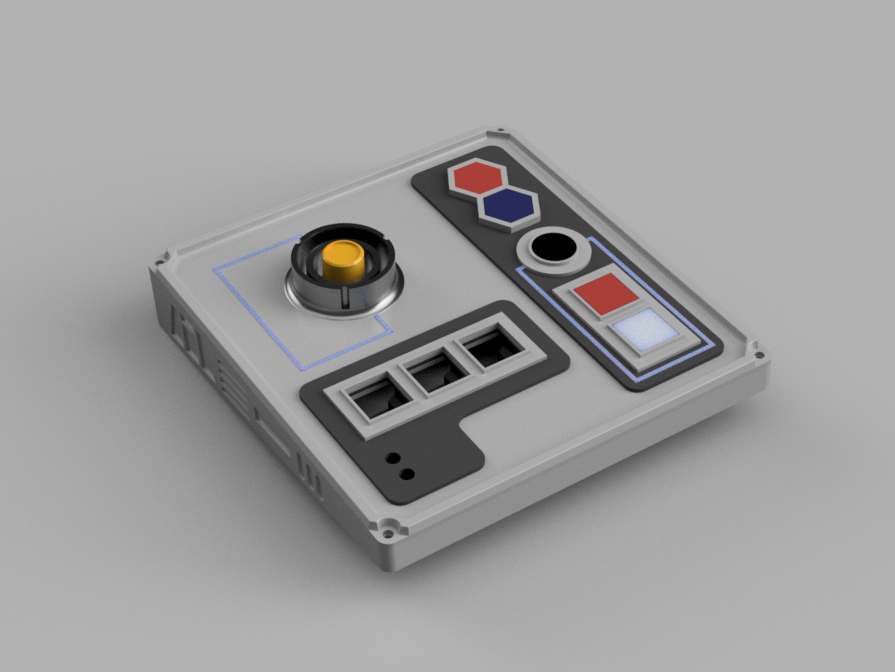
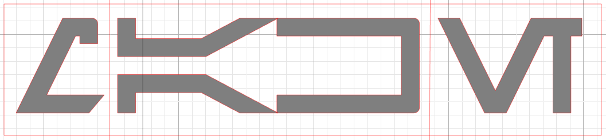

# Star Wars Macro Keyboard

This is a Star Wars theme inspired device that you can connect to your computer and it will act as a fully functional HID keyboard.

**Features:**
- 5 configurable buttons
- A safety switch with a safety LED
- 2 additional LEDs 
- 3D-printable case

## Configuration

In the source code you can define what keycodes will be sent when the buttons are pressed. Check for the `Key definitions` section and update the values for your needs.

Useful sources:
- [Keyboard Modifiers in the Arduino Reference](https://www.arduino.cc/reference/en/language/functions/usb/keyboard/keyboardmodifiers/)
- [usb_hid_keys.h](https://gist.github.com/MightyPork/6da26e382a7ad91b5496ee55fdc73db2)
- [USB HID Usage Table](https://www.freebsddiary.org/APC/usb_hid_usages.php)
- [USB HID Usage Tables specification](https://www.usb.org/sites/default/files/documents/hut1_12v2.pdf)

## Safety Switch

This device acts as a HID keyboard when connected to your computer via USB. If the code is faulty there's a chance that it will send random keycodes to your computer that can make uploading a fixed code impossible.

Safety switch to the rescue! If the safety switch is not pressed the keyboard will not send any keycodes to your computer, but keeps the code running on the Arduino, so you can keep it powered and upload new code to it.

## Parts List

- 1pc **Arduino Pro Micro** - do NOT use other Arduino boards as this is the one that has the `ATmega32U4` chip that provides the required USB capabilities. This board is available in two variants, I used the 5V version.
- 1pc **red LED**
- 2pcs **white LEDs**
- 3pcs **220Ω resistors** - you may need different values if you use different LEDs or the 3.3V Arduino Pro Micro
- 5pcs 12×12×7.3mm tactile **momentary button**
- 1pc 8×8mm **push-button switch**
- 5pcs M3x5 **screws** (4 for the cover, 1 for fixing the Arduino board)
- Wires
- Glue
- Optional: if you do not want to solder the wires directly to the Arduino you can use **right angle pin headers** and **Dupont connectors**. I used jumper wires.

## Naming

The following image shows how the buttons and LEDs are named both in the wiring diagram and in the code:

Note that not all parts are functional, some are [greeblies](https://en.wikipedia.org/wiki/Greeble).

## Wiring

You can see the wiring in the [Fritzing file](./wiring/star-wars-macro-keyboard.fzz) in the `wiring` folder:

Notes:
- The `H1`-`H3` (horizontal) and the `V1`-`V2` (vertical) buttons are momentary buttons.
- The `Armed button` is a latching switch.
- You may need to adjust the resistors' values to the LEDs and the Arduino variant you use.
- The `LED V1` and `LED v2` must be connected to PWM ports to be dimmable from code.

You can see how I did the wiring in the [photos](./photos) folder.

## 3D Printable Case

### Materials

You will need the following filament colors if you do not want to paint them:
- **Grey** for the case bottom and the top and the button frames
- **Matte Black** for the top frames
- **Glossy black** for the round greeblie
- **White** and **blue** for the button caps and for the stripes
- **Transparent red** for the armed LED cap
- **Silver** for the data port greeblie's outer rims
- **Gold** for the data port greeblie's inner shaft

Needless to say you can choose different colors or paint the parts.

### Printing

**The 3D printable models are available on [Thingiverse](https://www.thingiverse.com/thing:4647245).** I designed the model in Fusion 360 and published both the source files and exported them in STEP format so you can customize it to your needs.

No parts require supports, but you have to rotate some parts upside down and lay the case bottom part to the print bed.

You can print most parts with 0.3mm layer height, but I recommend printing the data port outer rims and the case bottom with 0.2mm. Because the parts are designed to snap fit to each other make sure your first layer width is dialed in correctly or configure [elephant foot compensation](https://help.prusa3d.com/en/article/elephant-foot-compensation_114487).

### Post processing

The 3D printed parts are designed fit tight tolerance, they should snap fit together, though you may need a little glue to keep them in place.

The button caps are designed with a slightly larger tolerance, but if you still experience some friction when pressing the buttons you can sand their sides.

## Labels and Stripes

The labels are not part of the 3D models, I used [David Occhino's free Arubesh font](http://davidocchino.com/portfolio/typography/aurebesh.html) to create them with my Silhouette Cameo and matte black vinyl. You can find the files in the [labels](./labels) folder.

Other sources for the Arubesh font:
- [Wikipedia article](https://en.wikipedia.org/wiki/Languages_in_Star_Wars) and [SVG file](https://en.wikipedia.org/wiki/Languages_in_Star_Wars#/media/File:Star-Wars-aurek-besh-alphabet-chart.svg)
- [Wookieepedia article](https://starwars.fandom.com/wiki/Aurebesh)
- [Arubesh Translator](https://lingojam.com/AurebeshTranslator)
- [Learn Arubesh](https://aurebesh.org/)

You can create the stripes either with 3D printer, vinyl cutter or you can simply paint them.

## Acknowledgements

This project was inspired by [David E. Madison's Building a DIY Stream Deck](https://www.partsnotincluded.com/diy-stream-deck-mini-macro-keyboard/) and [The Smugglers Room](https://www.thesmugglersroom.com/). Thanks both for sharing their passion and knowledge with the community.

## About the author

This project was created by [György Balássy](https://linkedin.com/in/balassy).
